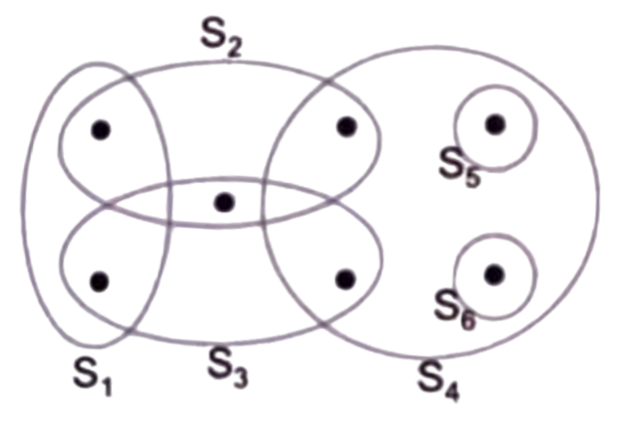

ALL about the following topics:

1. NP and Computational Intractability NP 问题与计算难解性
2. FPT (fixed parameter tractable) 固定参数可解性（FPT, Fixed Parameter Tractable）
3. Nash Equilibrium 纳什均衡
4. Amortized Analysis 摊还分析
5. Randomized Analysis 随机化分析
6. Approximation Analysis 近似分析

## Recitation 1

1. If $\text{VERTEX-COVER} \in \text{P}$ then $\text{SAT} \in \text{P}$. Is this true or false? Give a brief justification for your answer.
2. The vertex cover problem and the independent set problem are equivalent, since on any graph $G=(V,E)$, $C\subseteq V$ is a vertex cover iff $V-C$ is an independent set. So the 2-approximation algorithm for the vertex cover problem is also a 2-approximation algorithm for the independent set problem. Is this true or false? Give a brief justification for your answer.

1. 若顶点覆盖问题（$\text{VERTEX-COVER}$）属于$\text{P}$类问题，则可满足性问题（$\text{SAT}$）也属于$\text{P}$类问题。该命题是否成立？请给出简要证明。
2. 顶点覆盖问题与独立集问题是等价的，因为对于任意图$G=(V,E)$，集合$C\subseteq V$是顶点覆盖当且仅当$V-C$是独立集。因此，顶点覆盖问题的2-近似算法同样也是独立集问题的2-近似算法。该命题是否成立？请给出简要证明。

 

 

 

 

 

 

 

 

 

 

 

## Recitation 2

For a problem parametrized by $ k $ (in addition to the input size $ n $, suppose we have an algorithm with running time $O(k^k \cdot \text{poly}(n)) $. For what values of $k $ is this algorithm a polynomial-time algorithm?

对于一个由参数 $ k $（以及输入规模 $ n $）刻画的问题，假设存在一个算法，其运行时间为 $O(k^k \cdot \text{poly}(n)) $。请问当 $k $取何值时，该算法是多项式时间算法？

 

 

 

 

 

 

 

 

## Recitation 3  Unweighted Set Cover

This question is about the unweighted set cover problem. The instance has 7 elements and 6 sets.

- (a) Give an optimal set cover for the instance. (Which sets do you take?)

- (b) Write down the ILP for set cover for the given example.
- (c) For this example, give a solution to the LP-relaxation which has value strictly smaller than the value of the optimal set cover.

无权重集合覆盖问题
本题围绕无权重集合覆盖问题展开。该实例包含7个元素和6个集合。

- (a) 给出该实例的一个最优集合覆盖（你会选择哪些集合？）
- (b) 为给定的例子写出集合覆盖的整数线性规划（ILP）模型。
- (c) 针对该例子，给出线性规划松弛（LP-relaxation）的一个解，其目标函数值严格小于最优集合覆盖的目标函数值。

 

 

 

 

 

 

 

 

## Recitation 4  **FPTAS for Knapsack**

Recall that in the FPTAS we gave for the knapsack problem, we rounded up all the values to the nearest multiple of $\theta $, and then ran the dynamic programming algorithm. Now consider the other possible way of rounding:

- If we round all values down to the nearest multiple of $ \theta $ (for whatever $\theta $ that is necessary), and run the dynamic programming algorithm, does this still give an FPTAS?

**背包问题的完全多项式时间近似方案（FPTAS）**
回顾我们针对背包问题给出的FPTAS：我们将所有物品的价值**向上取整**到$ \theta $的最近倍数，然后运行动态规划算法。现在考虑另一种取整方式：

- 若我们将所有价值**向下取整**到$\theta $的最近倍数（无论$\theta $取何必要值），再运行动态规划算法，这是否仍然能得到一个FPTAS？

 

 

 

 

 

 

 

 

 

## Recitation 5 Randomized Algorithm for Independent Set

Let $G  $ be an undirected graph with $n  $ nodes and $m  $ edges where $n \leq 2m  $. Recall that an independent set of $G  $ is a subset $U  $ of vertices such that there does not exist an edge whose endpoints are both in $U  $. Consider the following randomized algorithm for finding an independent set:Step 1: Delete each node (and its incident edges) with probability $1 - p  $ where $p = \frac{n}{2m}  $.
Step 2: If there are edges remaining, delete one of the endpoints (and its incident edges). Repeat until there are no edges remaining.

Let $U  $ be the set of nodes that have not been deleted.

① Argue that $U  $ is an independent set.
② Let $X  $ be the number of nodes that remain after Step 1. What is the value of $\mathbb{E}[X]  $? Justify your answer.
③ Let $Y  $ be the number of edges that remain after Step 1. What is the value of $\mathbb{E}[Y]  $? Justify your answer.
④ Prove that the expected size of $U  $ is at least $\frac{n^2}{4m}  $. Hints: Bound $|U|  $ in terms of $X  $ and $Y  $.

设 $G  $ 是一个有 $n  $ 个节点、$ m  $ 条边的无向图，满足 $n \leq 2m  $。回顾：图 $G  $ 的独立集是顶点的一个子集 $U  $，满足 $U  $ 中不存在任意两个顶点构成一条边的端点。考虑以下用于寻找独立集的随机算法：

步骤1：以概率 $1 - p  $ 删除每个节点（及其关联的边），其中 $p = \frac{n}{2m}  $。
步骤2：若仍存在剩余边，则删除其中一个端点（及其关联的边）。重复此操作直到没有边剩余。

设 $U  $ 是未被删除的节点构成的集合。

① 证明 $U  $ 是一个独立集。
② 设 $X  $ 是步骤1后剩余的节点数，求 $\mathbb{E}[X]  $（期望）的值，并说明理由。
③ 设 $Y  $ 是步骤1后剩余的边数，求 $\mathbb{E}[Y]  $（期望）的值，并说明理由。
④ 证明 $U  $ 的期望大小至少为 $\frac{n^2}{4m}  $。提示：用 $X  $ 和 $Y  $ 对 $|U|  $ 进行放缩。

## **Recitation 6**

You want to find a perfect hash function for mapping a given set of  $n  $ items into a table of size  $ m  $. A hash function is *perfect* if there are no collisions, i.e., each of the  $n  $ items is mapped to a different slot in the hash table. Of course, a perfect hash function is only possible if  $m \geq n  $. Suppose you try to find a perfect hash function by brute force, namely, repeatedly pick ideal random hash functions until you find one that happens to be perfect. Recall that an ideal random hash function maps each item to the slots uniformly and independently. Let  $\alpha = \frac{n}{m}  $ be the load factor.

(a) (3 points) Suppose you pick an ideal random hash function  $h  $. What is the exact (i.e., do not use asymptotic notation) expected number of pairs of items that collide, as a function of  $n  $ and  $m  $? (b) (3 points) Suppose you pick an ideal random hash function  $h  $. What is the exact expected fraction of items that do not collide with any other item. What is the limit of this fraction as  $m  $ and  $n  $ go to infinity, as a function of  $\alpha  $? (c) (3 points) What is the exact probability that a random hash function is perfect? (d) (3 points) What is the exact expected number of ideal random hash functions you have to test before you find a perfect hash function?

你需要找到一个完美哈希函数，将给定的  $n  $ 个元素映射到大小为  $m  $ 的哈希表中。若哈希函数不存在冲突（即每个元素都被映射到哈希表的不同槽位），则称其为*完美*的。显然，只有当  $m \geq n  $ 时，完美哈希函数才可能存在。假设你通过暴力法寻找完美哈希函数：重复选取“理想随机哈希函数”，直到找到一个恰好是完美的函数。回忆：理想随机哈希函数会将每个元素独立且均匀地映射到哈希表的槽位上。令  $\alpha = \frac{n}{m}  $ 为负载因子。

(a)（3分）假设你选取了一个理想随机哈希函数  $h  $。请写出冲突元素对的**精确**（即不使用渐近记号）期望数量，用  $n  $ 和  $ m  $ 表示。 (b)（3分）假设你选取了一个理想随机哈希函数  $h  $。请写出“不与任何其他元素冲突的元素”的**精确**期望比例；并写出当  $ m  $ 和  $n  $ 趋于无穷大时，该比例关于  $\alpha  $ 的极限。 (c)（3分）一个随机哈希函数是完美哈希函数的**精确**概率是多少？ (d)（3分）你需要测试的理想随机哈希函数的**精确**期望数量是多少（直到找到一个完美哈希函数为止）？